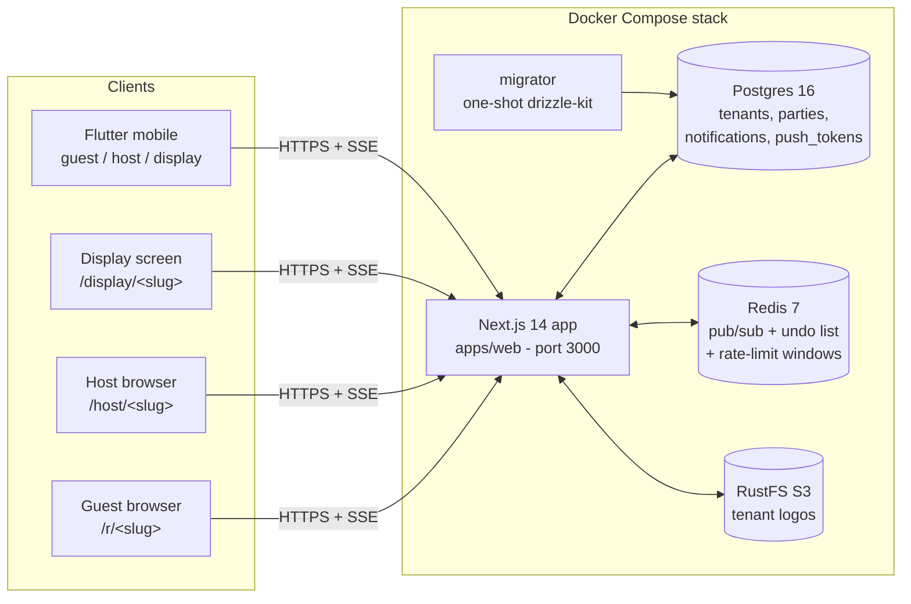
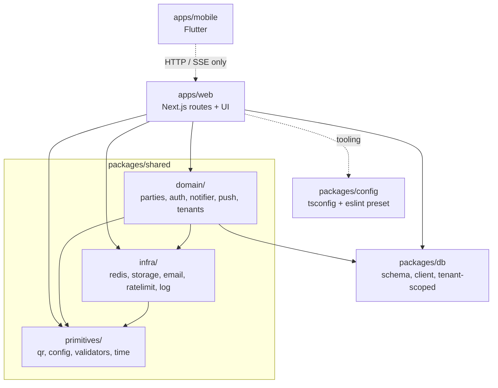
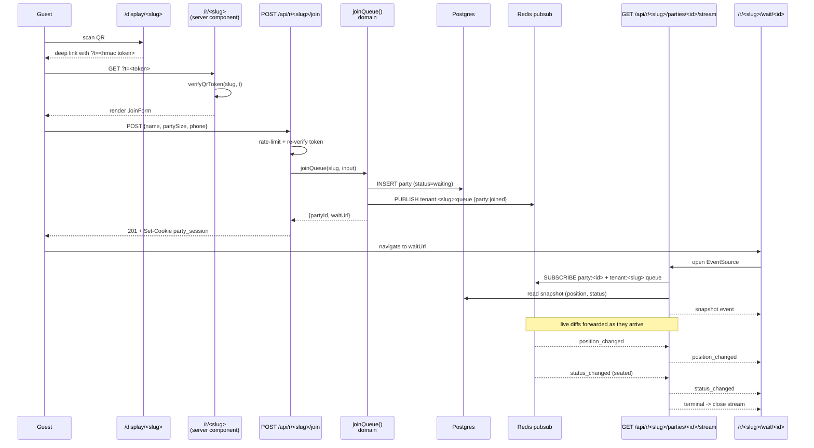
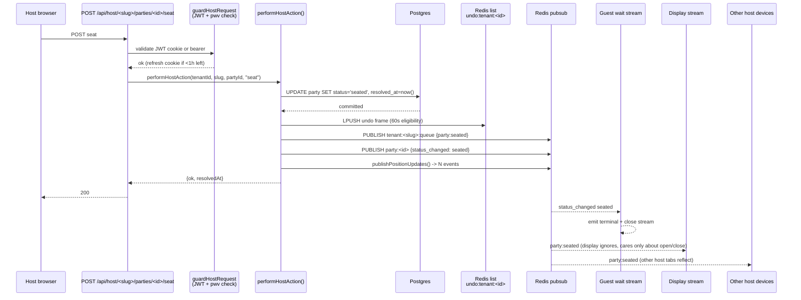

# Onboarding to Pila Lang

This is the document you should read first when you start contributing to Pila Lang. It is written for any engineer joining the project — whether you've shipped Next.js apps for years or you're meeting Drizzle for the first time. The goal is not to teach you the frameworks; it's to give you a solid mental model of _this_ system: what it does, how the pieces fit, where the load-bearing invariants live, and where you'll be expected to look first.

The doc is standalone. Other docs (`docs/Technical-Spec.md`, `docs/PRD.md`, `docs/RUNBOOK.md`, `DESIGN.md`, `CLAUDE.md`) go deeper on specific topics; you should not need them to start contributing.

---

## Table of contents

1. [Mental model in one paragraph](#1-mental-model-in-one-paragraph)
2. [What we're building](#2-what-were-building)
3. [Tech stack at a glance](#3-tech-stack-at-a-glance)
4. [System architecture](#4-system-architecture)
5. [Repo layout](#5-repo-layout)
6. [Day 1: get it running locally](#6-day-1-get-it-running-locally)
7. [The three surfaces](#7-the-three-surfaces)
8. [Key flow #1: guest join + wait](#8-key-flow-1-guest-join--wait)
9. [Key flow #2: host actions (seat, remove, undo)](#9-key-flow-2-host-actions-seat-remove-undo)
10. [SSE + Redis pub/sub](#10-sse--redis-pubsub)
11. [Auth model](#11-auth-model)
12. [Tenancy & data scoping](#12-tenancy--data-scoping)
13. [Mobile (Flutter) overview](#13-mobile-flutter-overview)
14. [Load-bearing invariants](#14-load-bearing-invariants)
15. [Testing](#15-testing)
16. [Conventions](#16-conventions)
17. [Design system](#17-design-system)
18. [Glossary](#18-glossary)
19. [Common tasks ("I want to…")](#19-common-tasks-i-want-to)
20. [Where to read next](#20-where-to-read-next)
21. [Command cheat sheet](#21-command-cheat-sheet)

Cover-to-cover is roughly 75 minutes. Sections 1–6 (~25 min) are the prerequisites for landing your first change; the rest you can read on demand.

---

## 1. Mental model in one paragraph

Pila Lang is a **single Next.js process** that backs three browser surfaces (guest, host, display) plus a Flutter mobile client. **Postgres** is the source of truth for tenants, parties, and audit trails. **Redis** is the live coordination layer — pub/sub for SSE fan-out, a list for the undo stack, and sliding windows for rate limits. **RustFS** stores tenant logos behind an S3 API. The product is multi-tenant from day one: every URL is `/<surface>/<slug>/...`, and every database query is scoped by `tenant_id`. Every mutation that affects the queue follows the same pattern — write to Postgres first, then publish to Redis after the commit, then let SSE fan it out to anyone watching. If you internalize that loop and the **subscribe → snapshot → forward** order on the SSE side, you understand 80% of the system.

---

## 2. What we're building

_~3 min read._

Pila Lang is a hosted, QR-first waitlist for small restaurants. The name is Tagalog shorthand for "just a line" — a nod to the universal Filipino waiting experience.

The user story in one paragraph: a guest walks up to a restaurant, scans a QR code on a display by the door, fills in name + party size + phone, and lands on a wait page that updates in real time as parties ahead of them are seated. The host runs `/host/<slug>` on a tablet at the stand, sees the queue live, and taps Seat or Remove to advance it. When the guest's row hits the top and the host taps Seat, their wait page transitions to "your table is ready."

That's the whole product. There are no tables, no reservations, no payments, no SMS in v1. The proposition is "we replaced your clipboard with a phone screen, and the guest can see their position from across the street."

We are **pre-pilot v1**. Breaking changes are expected. The product is built for one restaurant at a time but multi-tenant from day one — the server runs many tenants, each isolated by a URL slug.

The three user surfaces:

- **Guest** — `/r/<slug>` (join form) and `/r/<slug>/wait/<partyId>` (live position). Public, QR-gated, no account.
- **Host** — `/host/<slug>` (login) and `/host/<slug>/queue` (queue management). Per-tenant shared password.
- **Display** — `/display/<slug>`. Kiosk view that shows the rotating QR and tenant branding.

There is also an **admin** surface (`/admin`) for internal staff to provision tenants and reset the demo.

---

## 3. Tech stack at a glance

_~2 min read._

| Layer           | Choice                                           | Why we picked it                                                                     |
| --------------- | ------------------------------------------------ | ------------------------------------------------------------------------------------ |
| Web framework   | **Next.js 14 (App Router)**                      | Server Components for fast initial paints; built-in streaming for SSE.               |
| Language        | **TypeScript 5.6**                               | Strict mode, including `noUncheckedIndexedAccess`.                                   |
| ORM             | **Drizzle**                                      | SQL-first, type-safe, no runtime overhead, generated migrations live in the repo.    |
| Database        | **Postgres 16**                                  | Boring and reliable.                                                                 |
| Cache + pub/sub | **Redis 7**                                      | Pub/sub for SSE fan-out, lists for the undo stack, sliding windows for rate limits.  |
| Object store    | **RustFS** (dev) → S3 in prod                    | Apache-2.0 Rust S3 server. App talks generic S3 protocol via `S3_*` env vars.        |
| Styling         | **Tailwind + shadcn/ui**                         | Tokens in CSS variables; primitives wrapped per the design system (see `DESIGN.md`). |
| Forms / data    | **TanStack Query**, **Zod**                      | Zod validates every request body server-side.                                        |
| Auth (admin)    | **NextAuth + Resend magic link**                 | Allow-list email gate (`ADMIN_EMAILS`).                                              |
| Auth (host)     | **Custom JWT** (jose)                            | Shared per-tenant password → JWT cookie, with rolling refresh + version check.       |
| Auth (guest)    | **Session cookie** + **bearer token** for mobile | UUID linking guest to their party row.                                               |
| Mobile          | **Flutter 3.41+** (Dart 3.11+)                   | Single codebase for iOS + Android; same API as web.                                  |
| Push            | **Firebase Cloud Messaging**                     | Single gateway for APNs + FCM. v1.5+ feature.                                        |
| Container       | **Docker Compose**                               | Self-hosted, one box. No serverless, no edge.                                        |
| Package manager | **pnpm 10.23 + Turborepo**                       | Workspace caching, parallel task graph.                                              |

Everything runs as **one Next.js process**. There are no edge functions and no serverless split. SSE requires a long-lived Node connection, so we built around that constraint and haven't looked back.

If you've shipped a Rails or Django app before, the closest mental analogue is "a monolith with a websocket" — except the websocket is SSE (one-way, plain HTTP) and the fan-out is Redis pub/sub instead of in-process channels.

---

## 4. System architecture

_~5 min read._



Things to notice:

- **One Node process** serves every surface and every API route. There is no edge runtime. `app` is a long-lived container whose primary job is to keep SSE connections open.
- **Two Redis connections, not one.** We hold a single dedicated subscribe connection (multiplexed across all SSE streams) and a separate pooled client for publishes, rate-limit reads, and the undo list. The reason: a Redis client in subscribe mode cannot run normal commands. The split is wired in `packages/shared/src/infra/redis/pubsub.ts` and the underlying `client.ts`.
- **RustFS speaks S3 protocol.** In prod you swap `S3_ENDPOINT` to AWS S3 (or any compatible object store) and nothing else changes. The Compose service is named `minio` for backward compatibility — the image is actually `rustfs/rustfs`.
- **`migrator` is one-shot.** It runs `pnpm db:migrate` and exits. The `app` service has `depends_on: migrator: condition: service_completed_successfully` so it never starts on a stale schema.
- **Mobile is a pure client.** Flutter has zero workspace dependencies; it talks to the web API over HTTPS and SSE just like a browser does.

The data plane and the live plane are separated on purpose. Postgres is the source of truth — if Redis were wiped, the queue would still be correct on the next page load. Redis is just the wire that carries "something changed" notifications between processes (or between the writer and the readers within the same process).

---

## 5. Repo layout

_~5 min read._

```
restaurant/
├── apps/
│   ├── web/                  # @pila/web — Next.js 14 App Router
│   │   ├── app/              # routes (App Router)
│   │   │   ├── r/[slug]/         # guest join + wait
│   │   │   ├── host/[slug]/      # host login, queue, settings, guests
│   │   │   ├── display/[slug]/   # kiosk QR display
│   │   │   ├── admin/            # internal admin (NextAuth)
│   │   │   ├── api/              # route handlers — mirrors above + /api/test/*
│   │   │   └── design-system/    # living styleguide page
│   │   ├── lib/
│   │   │   ├── auth/             # guard-host-page.ts (server-component guard)
│   │   │   ├── sse/              # stream.ts, use-live-stream.ts, apply-tenant-event.ts
│   │   │   ├── routes/           # host-party-action.ts, host-open-close.ts
│   │   │   ├── forms/            # use-json-mutation.ts
│   │   │   ├── i18n/en.ts        # ALL strings live here
│   │   │   ├── time.ts
│   │   │   └── utils.ts          # shadcn cn()
│   │   └── components/           # shadcn primitives + app components
│   └── mobile/               # @pila/mobile — Flutter 3.41+
│       └── lib/
│           ├── api/              # HTTP client
│           ├── auth/             # JWT storage, guards
│           ├── sse/              # EventSource client
│           ├── state/            # Riverpod providers
│           ├── domain/           # business logic mirrored from web
│           ├── push/             # FCM integration
│           ├── persistence/      # sqflite cache
│           ├── deeplink/         # Universal Links / App Links
│           ├── kiosk/            # wakelock, immersive mode
│           ├── theme/            # design-system port
│           └── screens/
│               ├── guest/        # join, wait
│               ├── host/         # login, queue, settings
│               ├── display/      # kiosk
│               └── entry/        # router landing
├── packages/
│   ├── db/                   # @pila/db
│   │   ├── src/schema.ts         # Drizzle tables (tenants, parties, ...)
│   │   ├── src/client.ts         # Drizzle client
│   │   ├── src/tenant-scoped.ts  # tenantDb() — every query goes through here
│   │   └── migrations/           # generated SQL — applied at boot, never imported
│   ├── shared/               # @pila/shared
│   │   └── src/
│   │       ├── domain/           # business rules (auth, parties, notifier, push, tenants)
│   │       ├── infra/            # IO adapters (redis, storage, email, ratelimit, log)
│   │       └── primitives/       # pure utils (qr, config, validators, time)
│   └── config/               # @pila/config — shared tsconfig + eslint preset
├── scripts/
│   ├── seed.ts               # entry — delegates to seed/cli.ts
│   └── seed/                 # cli.ts, tenant.ts, parties.ts
├── e2e/specs/                # Playwright (smoke, guest, host, admin, ops)
├── docs/                     # Technical-Spec, PRD, User-Stories, RUNBOOK, progress
├── docker/                   # Dockerfile assets, compose-prod helpers
├── docker-compose.yml        # dev stack
├── docker-compose.prod.yml   # prod stack
├── DESIGN.md                 # visual brand contract
├── CLAUDE.md                 # AI agent instructions (good architecture summary)
├── README.md
└── ONBOARDING.md             # you are here
```

### Package layering



The rule:

- Arrows flow **downward only**. `domain/` may import `infra/` and `primitives/`. `infra/` may import `primitives/`. `primitives/` imports nothing else from `shared/`.
- `apps/web` is allowed to import from any layer.
- `packages/db` is independent (only Drizzle).
- `apps/mobile` has zero workspace imports — it talks to the web app over HTTP.

This direction is enforced by code review, not lint. Treat the layering as load-bearing — domain logic should never reach for `next/server` or for direct Redis clients.

### Workspace import paths

- From any package: `@pila/db/...`, `@pila/shared/domain/...`, `@pila/shared/infra/...`, `@pila/shared/primitives/...`
- Inside `apps/web`: `@/...` resolves to `apps/web/...` (Next plugin)

---

## 6. Day 1: get it running locally

_~10 min read, ~15 min to actually do it._

### Prerequisites

- **Node ≥ 22** (`.nvmrc` is set; use `nvm use` or fnm)
- **pnpm 10.23.0** — `corepack enable` then `corepack prepare pnpm@10.23.0 --activate`
- **Docker** + Docker Compose
- **Flutter 3.41+** if you'll touch mobile (otherwise skip)
- A POSIX shell. Windows is untested; use WSL2.

### The canonical first run

```bash
# 1. Clone
git clone https://github.com/spencerjireh/pila-lang.git
cd pila-lang

# 2. Env
cp .env.example .env
# Edit .env: replace the placeholder secrets with real 32+ char random strings.
# `openssl rand -base64 48 | tr -d '\n='` works. Or use `pwgen 48 1`.
# Set ADMIN_EMAILS to your own email so you can sign into /admin.

# 3. Bring up dev services
docker compose up -d postgres redis minio migrator
# Wait for migrator to exit cleanly:
docker compose logs -f migrator   # ctrl-c when you see the schema applied

# 4. Install deps
pnpm install

# 5. Seed the demo tenant
pnpm seed --tenant=demo
# Look for the printed host password in the output — copy it,
# you will need it to log into /host/demo. It is only printed
# once; subsequent runs say `passwordPreserved: true`.

# 6. Run the dev server
pnpm dev
```

### URLs to open

| Surface       | URL                                   | Notes                                                               |
| ------------- | ------------------------------------- | ------------------------------------------------------------------- |
| Display       | http://localhost:3000/display/demo    | Shows a rotating QR; click the QR or copy the URL into another tab. |
| Guest join    | (the URL embedded in the display QR)  | Has a `?t=<token>` query param. Required.                           |
| Host login    | http://localhost:3000/host/demo       | Use the password printed in step 5.                                 |
| Host queue    | http://localhost:3000/host/demo/queue | After login. Live SSE-driven.                                       |
| Admin         | http://localhost:3000/admin           | Magic-link sign-in (only accepts `ADMIN_EMAILS`).                   |
| Design system | http://localhost:3000/design-system   | Living styleguide (noindex).                                        |
| Health        | http://localhost:3000/api/health      | Plain JSON ok-check.                                                |

### Smoke test

To prove the stack is alive end-to-end:

1. Open `/display/demo` in window A. Wait for the QR to render.
2. Click the QR. A new tab opens at `/r/demo?t=...` — the guest join form.
3. Submit a name, size 2, and any phone. You should land on `/r/demo/wait/<partyId>` with position **1**.
4. In window B, open `/host/demo` and sign in. The queue list should already show your party at the top.
5. Click **Seat**. Window A's wait page transitions to "your table is ready" within a second.
6. Click **Undo** (within 60s) on the host queue. The party returns to waiting and window A reverts to position 1.

If any of those steps fails, see the diagnostics below.

### "It doesn't work" diagnostics

| Symptom                                              | Likely cause                                                            | Fix                                                                                                              |
| ---------------------------------------------------- | ----------------------------------------------------------------------- | ---------------------------------------------------------------------------------------------------------------- |
| `pnpm dev` errors with `Cannot find module @pila/db` | You ran `pnpm install` from a sub-package, not the root                 | `cd` to root, `pnpm install`                                                                                     |
| Migrator container exits non-zero                    | Postgres wasn't ready yet                                               | `docker compose down`, `docker compose up -d postgres`, wait for `pg_isready`, then `docker compose up migrator` |
| `/r/demo?t=…` shows "QR expired"                     | Your laptop clock skewed                                                | Verify clock; QR window is 65 minutes                                                                            |
| Wait page sits on "connecting" forever               | `REDIS_URL` is wrong, or Redis port not exposed                         | `docker compose ps redis`; check `.env` has `redis://localhost:6379`                                             |
| `pnpm seed` fails on phone-unique constraint         | An older seed left rows                                                 | `pnpm seed --reset` then re-run                                                                                  |
| `/admin` says "magic link not delivered"             | `RESEND_API_KEY` is `re_test_*` (no real send) — that's expected in dev | Read the Resend dashboard or use the test-magic-link store under `apps/web/app/api/test/*`                       |
| Logo upload 500s                                     | RustFS not healthy                                                      | `docker compose logs minio`; the `health` endpoint must return 200                                               |
| `pre-commit` hook fails on typecheck                 | Genuine type error somewhere                                            | Fix it. **Never `--no-verify`.** The hook exists for a reason.                                                   |

---

## 7. The three surfaces

_~3 min read._

Each surface is a different App Router subtree. They share the API but have separate auth models and different SSE channels. Knowing which is which saves a lot of grep time.

### Guest (`/r/<slug>`)

- `apps/web/app/r/[slug]/page.tsx` — server component that verifies the QR token, rate-limits per IP, checks for an existing waiting party (so refreshes don't re-prompt), and renders the join form.
- `apps/web/app/r/[slug]/wait/[partyId]/page.tsx` — server component that validates the session cookie, computes the initial position, and renders `WaitView` with the SSE stream URL.
- `apps/web/app/api/r/[slug]/join/route.ts` — POST handler. Calls `joinQueue()` from the domain.
- `apps/web/app/api/r/[slug]/parties/[partyId]/stream/route.ts` — SSE endpoint.
- `apps/web/app/api/r/[slug]/parties/[partyId]/leave/route.ts` — guest-initiated leave.

Auth: `party_session` HttpOnly cookie scoped to the party row. No account.

### Host (`/host/<slug>`)

- `apps/web/app/host/[slug]/page.tsx` — login form (password).
- `apps/web/app/host/[slug]/queue/page.tsx` — queue management (the workhorse page).
- `apps/web/app/host/[slug]/settings/...` — name / logo / accent / password rotation.
- `apps/web/app/host/[slug]/guests/page.tsx` — paginated guest history.
- `apps/web/app/api/host/[slug]/{login,logout,open,close,undo,queue,...}` — actions.
- `apps/web/app/api/host/[slug]/parties/[partyId]/{seat,remove}/route.ts` — party actions.
- `apps/web/lib/auth/guard-host-page.ts` — the server-component guard.
- `apps/web/lib/routes/host-party-action.ts` — shared route-handler logic for seat / remove.

Auth: `host_session` JWT cookie. JWT carries `pwv` (password version) and the slug.

### Display (`/display/<slug>`)

- `apps/web/app/display/[slug]/page.tsx` + `_components/display-client.tsx` — kiosk view.
- The QR rotates hourly; the page polls + animates a token swap with no flash.
- It reads tenant updates (open/close, accent, name, logo) over a tenant-scoped SSE stream so the screen never has to be reloaded after a setting change.

Auth: none. Public. Slug must exist.

### Admin (`/admin`)

- `apps/web/app/admin/...` — tenant CRUD, demo reset, password rotation. NextAuth magic-link sign-in. Allow-list gated by `ADMIN_EMAILS`.
- `apps/web/app/api/admin/...` — admin-only actions (delete tenant, reset demo, etc.).

Auth: NextAuth session, must exist in `admins` table AND be on `ADMIN_EMAILS`.

---

## 8. Key flow #1: guest join + wait

_~7 min read._

This is the most important flow in the product. Read it twice.



### Code walk

1. **Display embeds a token in the QR.** The display page reads `tenant.currentQrToken` and renders a deep link of the form `/r/<slug>?t=<token>`. The token is an HMAC of `<slug>:<issuedAtMs>` keyed by `QR_TOKEN_SECRET`. Token rotation is hourly with a 5-minute overlap; verification (`packages/shared/src/primitives/qr/token.ts`) accepts anything within a 65-minute window.

2. **Guest opens `/r/<slug>?t=...`.** Server component at `apps/web/app/r/[slug]/page.tsx`:
   - Rate-limit by IP (`guestViewPerIp`).
   - `verifyQrToken(slug, searchParams.t)`. Mismatch → 403.
   - `findWaitingPartyBySession(tenantId, session)` — if a `party_session` cookie already maps to a waiting party at this tenant, redirect them to their wait page instead of showing the form again.
   - Render `JoinForm` with the slug + token.

3. **Guest submits.** The browser hits `POST /api/r/<slug>/join` (`apps/web/app/api/r/[slug]/join/route.ts`):
   - Zod validates `{ name, partySize, phone }`.
   - Re-verifies the token (don't trust client cookies for this).
   - Rate-limits by phone number first; falls back to IP if no phone; also enforces a global 200/hour per tenant cap.
   - Calls `joinQueue(slug, input)` — see `packages/shared/src/domain/parties/join.ts:44`.

4. **`joinQueue` is the single source of truth.** It:
   - Loads the tenant by slug.
   - 404 if missing, 409 if `tenant.isOpen === false`.
   - Inserts a row in `parties` via `tenantDb(tenantId).parties.insert()` — note this **never** lets the caller forge `tenant_id`.
   - Catches the unique-index violation (`23505`) and returns `already_waiting` if this phone already has a waiting party.
   - Computes `phoneSeenBefore` (prior parties at this tenant for this phone).
   - **After commit**, publishes `{ type: "party:joined", id, name, partySize, phone, joinedAt }` to `tenant:<slug>:queue` so the host queue updates live.
   - Calls `notifier().onPartyJoined(party)` (Noop in v1; the FCM-backed notifier in v1.5+ is plumbed through here).
   - Returns `{ partyId, waitUrl: "/r/<slug>/wait/<id>", phoneSeenBefore }`.

5. **API response sets the session cookie** (`party_session=<sessionToken>; HttpOnly; Secure; SameSite=Lax; Max-Age=86400`) and a short-lived `welcome_back=1` cookie if `phoneSeenBefore` is true (5 min, not HttpOnly — the form reads it).

6. **Browser navigates to the wait page.** Server component at `apps/web/app/r/[slug]/wait/[partyId]/page.tsx`:
   - Validates `party_session` matches the `parties.session_token` for this party.
   - Computes the initial position via `computePosition(tenantId, partyId)` (rank among waiting parties, ordered by `joined_at`).
   - Renders `WaitView`, passing the SSE URL and the initial state.

7. **`WaitView` opens the SSE stream.** The `useLiveStream` hook (`apps/web/lib/sse/use-live-stream.ts`) wraps `EventSource`. The server route at `apps/web/app/api/r/[slug]/parties/[partyId]/stream/route.ts`:
   - Authenticates via `guardGuestRequest()` — accepts session cookie OR bearer token.
   - Calls `sseStream({ onSubscribe, snapshot, onClose })` from `apps/web/lib/sse/stream.ts:35`.
   - In `onSubscribe`: subscribes to `channelForParty(partyId)` and `channelForTenantQueue(slug)` and wires the listener to forward events.
   - In `snapshot`: re-reads position + status from Postgres and emits the first event.
   - The order is enforced by `stream.ts`: any events that fire while the snapshot is being read are buffered (see `bufferedBeforeSnapshot` at `apps/web/lib/sse/stream.ts:38`) and flushed after the snapshot writes.

8. **Live updates flow.** When any host action commits, `publishPositionUpdates(tenantId)` (`packages/shared/src/domain/parties/position.ts`) emits one `position_changed` event per waiting party with its new 1-indexed rank, on the `party:<id>` channel. The reducer at `apps/web/lib/sse/apply-tenant-event.ts` handles tenant-wide updates (`tenant:opened`, `tenant:closed`, etc.).

9. **Terminal status closes the stream.** When the party reaches `seated`, `no_show`, or `left`:
   - The SSE stream emits one final `status_changed` event and calls `handle.close()`.
   - The browser's `EventSource` will try to reconnect. The next request hits `resolvedPartyShortCircuit()` (`apps/web/lib/sse/stream.ts:121`) which returns **204 No Content**. `EventSource` treats 204 as a signal to stop retrying. This is the only way to stop the natural retry loop without errors in DevTools.

> **Gotcha #1.** If you ever swap the order of `onSubscribe` and `snapshot`, you will silently drop events. The contract is **subscribe first, snapshot second.** The buffer that catches events fired during the snapshot read is the only thing keeping us correct.

> **Gotcha #2.** The cookie `party_session` is set by the join route, not by the wait page. If you reach a wait page directly without going through join (e.g., a stale link), you'll get a 401 and a redirect back to `/r/<slug>`.

---

## 9. Key flow #2: host actions (seat, remove, undo)

_~6 min read._

This flow shows the **publish-after-commit** discipline and the undo stack. It's where most host-facing changes will land.



### Code walk

1. **Host taps Seat.** The host queue UI fires `POST /api/host/<slug>/parties/<partyId>/seat`. The route file is one line — it delegates to a shared handler at `apps/web/lib/routes/host-party-action.ts`.

2. **`hostPartyActionHandler("seat")`**:
   - Rate-limits by slug (`hostMutationPerSlug`).
   - Calls `guardHostRequest(reqLike, slug)` (`packages/shared/src/domain/auth/host-guard.ts`). This validates the `host_session` cookie OR a bearer token. The JWT carries `{ slug, pwv, iat, exp }`. Slug mismatch → 403. `pwv !== tenant.host_password_version` → 401 + clear cookie (this is how password rotation kicks other devices). If the JWT has < 1 hour left, refresh the cookie inline.
   - Calls `performHostAction(tenantId, slug, partyId, "seat")`.

3. **`performHostAction`** (`packages/shared/src/domain/parties/host-actions.ts:65`):
   - Builds a partial update: `{ status: "seated", seatedAt: now, resolvedAt: now }` (or `{ status: "no_show", resolvedAt: now }` for remove).
   - Runs an `UPDATE ... WHERE id = partyId AND status = 'waiting'`. The `status = 'waiting'` clause is the conflict guard: a double-tap from two devices means only one update affects rows.
   - If no row was updated, look up the row by id alone — if it exists, return `conflict`; if not, return `not_found`.
   - **Then, after the commit:**
     - Push an undo frame to Redis: `LPUSH undo:tenant:<tenantId> <frame>`. The frame carries `{ action, partyId, previousStatus: "waiting", timestamp }`. The list has a 5-minute TTL.
     - In parallel: publish the `party:seated` event to `tenant:<slug>:queue` (host listens), publish `status_changed` to `party:<id>` (guest listens), and call `publishPositionUpdates(tenantId)` which emits one event per remaining waiter so their position numbers tick up correctly.
   - On `seat`, fire `notifier().onPartyReady(party)` (push notifications in v1.5+).
   - Return `{ ok, party, resolvedAt }`.

4. **API responds 200** and applies the rolling JWT refresh via `applyHostRefresh()` if needed.

5. **Fan-out.** The guest's wait stream sees `status_changed: seated`, transitions to the terminal "your table is ready" state, and the SSE handle closes. Other host tabs see `party:seated` and re-render the queue, moving the row into the recently-resolved panel. The display surface ignores party events — it only cares about `tenant:opened` / `tenant:closed`.

### Undo

`POST /api/host/<slug>/undo` pops the most recent frame off `undo:tenant:<tenantId>`:

- If the frame is older than 60 seconds, return `too_old`.
- Otherwise, `UPDATE party SET status = 'waiting', resolved_at = NULL WHERE id = ? AND tenant_id = ?`.
- Publish `status_changed` to `party:<id>` and `party:restored` to `tenant:<slug>:queue` (`undoPublishPlan` in `host-actions.ts`).
- Publish position updates so everyone re-ranks.

The undo stack is **shared across all host sessions for a tenant.** That's deliberate: if Alice on the iPad seats a party and Bob on his phone hits Undo, that should work. Same Redis list, same eligibility window. See `packages/shared/src/domain/parties/undo-store.ts` and `host-actions.test.ts` for the property tests.

> **Gotcha.** The Redis publish must happen **after** the Postgres commit. If you publish before commit and the transaction rolls back, you've told the world about a state that doesn't exist. Look for `await scoped.parties.update(...).returning()` followed by `await Promise.all([publish(...), publishPositionUpdates(...)])` in any new write path.

---

## 10. SSE + Redis pub/sub

_~5 min read._

The live wiring is the load-bearing piece of the product. If the SSE bus is broken, every UX claim (live position, instant seat, undo across devices) goes with it.

### Channel naming

Two channels per tenant:

- `tenant:<slug>:queue` — host queue + display. Receives `party:joined`, `party:seated`, `party:removed`, `party:left`, `party:restored`, `tenant:opened`, `tenant:closed`, `tenant:updated`, `tenant:reset`.
- `party:<id>` — guest wait page. Receives `status_changed`, `position_changed`.

Helpers live in `packages/shared/src/infra/redis/pubsub.ts:74-80`:

```ts
channelForTenantQueue(slug); // "tenant:<slug>:queue"
channelForParty(partyId); // "party:<id>"
```

Always use these helpers. Hand-rolling the strings is how you accidentally publish to the wrong channel.

### One subscribe connection, multiplexed

Inside `pubsub.ts` we keep a single Redis subscribe client (`redisSub()`) and a `Map<channel, Set<Listener>>`. When a route calls `subscribe(channels, listener)`, we either add to the existing set or issue a real `SUBSCRIBE` command if the channel is brand new. The reverse on unsubscribe. This means N concurrent SSE streams = 1 Redis subscribe connection, not N.

**Why:** Redis subscribe-mode connections cannot run normal commands. If we used a fresh subscribe connection per stream, we'd hit Redis's `maxclients` very quickly under any load.

### `sseStream()` is the only way to write SSE

Every SSE handler in `apps/web/app/api/...` calls `sseStream({ onSubscribe, snapshot, onClose })` from `apps/web/lib/sse/stream.ts`. The function:

1. Opens a `ReadableStream<Uint8Array>`.
2. Sets up a 15-second heartbeat (`":ping\n\n"` comment lines) so proxies don't kill the connection.
3. Calls `onSubscribe(handle)` — this is where you call `subscribe(...)` and forward events via `handle.send(event)`.
4. Calls `snapshot(handle)` and emits its return value as the first event. **Crucially**, while the snapshot is being computed, any events sent via `handle.send(event)` are buffered into `bufferedBeforeSnapshot`. They flush after the snapshot writes, in order.
5. After that, `handle.send(event)` writes directly to the stream.
6. On close (`handle.close(finalEvent?)`), flushes a final event and calls `onClose` so you can unsubscribe from Redis.

Read `apps/web/lib/sse/stream.ts` once, end to end. It is short (~120 lines) and you will need to reason about it.

### Client side

`apps/web/lib/sse/use-live-stream.ts` wraps `EventSource`. It's a thin React hook that exposes `{ reconnecting, close }` and calls `onEvent(json)` for every received message. The browser handles retry logic natively, so we don't try to be clever.

`apps/web/lib/sse/apply-tenant-event.ts` is a small reducer used by the wait view, host queue view, and display client to merge `tenant:*` events into local state consistently. If you add a new tenant-wide event type, update this reducer too.

### Position updates

Whenever a reorder happens (seat, remove, leave, undo), call `publishPositionUpdates(tenantId)` from `packages/shared/src/domain/parties/position.ts`. It reads the current waiting parties for the tenant in `joined_at` order and publishes one `position_changed` event per party with its new 1-indexed rank, on its `party:<id>` channel.

Join does **not** call this — appending to the queue doesn't change anyone else's rank, so it's wasted writes.

---

## 11. Auth model

_~5 min read._

Three audiences, three auth schemes. They don't overlap.

### Guest

- **Cookie:** `party_session=<uuid>` (HttpOnly, Secure, SameSite=Lax, 24h).
- Set by the join route. Validated by every guest API by matching against `parties.session_token` for the `partyId` in the URL.
- Refreshed (re-set with a fresh max-age) every time the wait-page SSE reconnects, so a long wait doesn't expire mid-meal.
- **Bearer alternative:** the mobile app exchanges its cookie for a guest JWT via `POST /api/guest/token`. Same validation logic — the server accepts either via `guardGuestRequest()`.

### Host

- **Cookie:** `host_session=<jwt>` (HttpOnly, Secure, SameSite=Lax, 12h).
- Issued on `POST /api/host/<slug>/login` after bcrypt-comparing the submitted password to `tenants.host_password_hash`.
- Payload: `{ slug, pwv, iat, exp }` signed with `HOST_JWT_SECRET` (jose, HS256).
- Validated on every host API by `guardHostRequest()`:
  - Slug in payload must match URL slug → else 403.
  - `pwv` must equal `tenants.host_password_version` → else 401 and clear cookie. **This is how password rotation kicks other devices.** Rotating the password in `/host/<slug>/settings/password` bumps the version; every other device's next request gets logged out.
  - If the cookie has < 1h left, re-issue inline (rolling refresh).
- **Bearer alternative:** mobile exchanges via `POST /api/host/<slug>/token`. Same payload, same checks. Used by the Flutter host surface.

The "log out all other devices" button uses the same primitive: it bumps `pwv` without changing the password hash.

### Admin

- **NextAuth** session, magic-link sign-in via Resend.
- Email must be in `ADMIN_EMAILS` AND in the `admins` Postgres table. Either gate on its own is insufficient.
- The allow-list is read at request time, so adding/removing an admin is just an env-var edit + restart.
- Glue is in `packages/shared/src/domain/auth/admin-guard.ts` and `packages/shared/src/domain/auth/admin-session.ts`.

### QR token (not exactly auth, but adjacent)

- HMAC-SHA256 of `<slug>:<issuedAtMs>`, keyed by `QR_TOKEN_SECRET`.
- Encoded as `<payloadB64>.<signatureB64>`, identical shape to a JWT minus the header.
- Validity: 65 minutes from issuance. Display rotates the token hourly; the 5-minute overlap exists so a guest who scans right at the rotation boundary doesn't get a 403.
- Implementation: `packages/shared/src/primitives/qr/token.ts`. Tests at `token.test.ts`.

> **Gotcha.** Never mix auth schemes. A host endpoint should call `guardHostRequest()`. A guest endpoint should call `guardGuestRequest()`. A request that wants to accept both bearer and cookie should still go through the right guard — both guards already accept either source.

---

## 12. Tenancy & data scoping

_~3 min read._

Every restaurant is a `tenant` row. Every party belongs to exactly one tenant. **Never let `tenant_id` leak to the client.** Resolve the tenant from the URL slug server-side every time.

### `tenantDb()`

The only sanctioned way to query `parties`, `notifications`, or `push_tokens` is through `tenantDb(tenantId)` (`packages/db/src/tenant-scoped.ts:61`). It returns a small CRUD interface that hardcodes `WHERE tenant_id = :tenantId` into every read, write, and delete:

```ts
const scoped = tenantDb(tenantId);
await scoped.parties.insert({
  name,
  phone,
  partySize,
  status: "waiting",
  sessionToken,
});
await scoped.parties.update({ status: "seated" }, eq(parties.id, partyId));
await scoped.parties.select(eq(parties.status, "waiting"));
```

If you call `tenantDb("")` it throws `TenantScopeError`. If you forget to filter further, you still don't leak across tenants.

The wrappers also strip any `tenantId` field from update payloads, so a malicious caller (or a sloppy refactor) cannot rewrite a row's tenant.

### Slug rules

- Pattern: `^[a-z0-9][a-z0-9-]{1,30}[a-z0-9]$` (3–32 chars, lowercase alphanumeric + hyphens, no leading/trailing hyphen).
- Reserved list (validator rejects these): `admin`, `api`, `r`, `host`, `display`, `www`, `public`, `static`, `_next`, `well-known`, `health`.
- **Slugs are immutable after tenant creation.** Printed QRs must keep working forever. The validator and the migration both enforce this.

### The schema, briefly

`packages/db/src/schema.ts` is short — read it. The main tables:

| Table                                          | Notes                                                                                                                                                                                                                             |
| ---------------------------------------------- | --------------------------------------------------------------------------------------------------------------------------------------------------------------------------------------------------------------------------------- |
| `tenants`                                      | `slug` unique, `host_password_hash`, `host_password_version`, `is_open`, `is_demo`, `current_qr_token`, `qr_token_issued_at`, `accent_color`, `logo_url`, `timezone`.                                                             |
| `parties`                                      | `tenant_id` FK, `status` enum (waiting/seated/no_show/left), `session_token`, `joined_at`, `seated_at`, `resolved_at`. Unique partial index `idx_parties_one_waiting_per_phone` enforces "one waiting party per (tenant, phone)". |
| `notifications`                                | Audit trail for the notifier. `channel`, `event_type`, `status`, `payload`.                                                                                                                                                       |
| `push_tokens`                                  | `scope` (guest_party / host_session), `scope_id`, `device_token`, `platform` (ios / android), `revoked_at`. Unique partial index on live (non-revoked) tokens.                                                                    |
| `admins`                                       | `email` unique. Allow-list-of-record.                                                                                                                                                                                             |
| `user / account / session / verificationToken` | NextAuth adapter tables.                                                                                                                                                                                                          |

### How a request resolves a tenant

`packages/shared/src/domain/tenants/display-token.ts` exports `loadTenantBySlug(slug)`. Every server entry point that has a `<slug>` URL param calls this function early (or its wrapper), then derives `tenantId` from the result. From there on, every DB call goes through `tenantDb(tenant.id)`. The slug is for humans and URLs; the UUID is for the data plane.

---

## 13. Mobile (Flutter) overview

_~5 min read._

`apps/mobile` is a Flutter 3.41+ codebase that ships three surfaces (guest, host, display) into a single binary. It's a **pure client** — there is no Dart server, no native bridge code beyond what plug-ins provide, and zero workspace dependencies on the TS packages.

### Toolchain

```bash
# One-time
brew install --cask flutter   # or fvm install 3.41.0
cd apps/mobile
cp lib/firebase_options.example.dart lib/firebase_options.dart
# (the real file is gitignored — it contains your Firebase project ids)
flutter pub get

# Day-to-day
flutter analyze            # static analysis, treated as errors in CI
flutter test               # unit + widget tests (~128)
flutter run -d <device>    # run on simulator or device
```

CI runs the same `analyze` + `test` in `.github/workflows/ci.yml` under a separate Flutter job.

### Package layout

```
apps/mobile/lib/
├── main.dart, app.dart       # entry + GoRouter wiring
├── api/                      # dio HTTP client; talks to /api/* over HTTPS
├── auth/                     # JWT storage (flutter_secure_storage), guards
├── sse/                      # EventSource client; mirrors web's apply-tenant-event reducer
├── state/                    # Riverpod providers (auth state, queue snapshot, etc.)
├── domain/                   # business logic mirrored from web
├── persistence/              # sqflite cache for offline reads
├── push/                     # FCM registration + token rotation
├── deeplink/                 # app_links: cold + warm start URL handling
├── kiosk/                    # wakelock_plus + immersive mode for /display
├── theme/                    # Fraunces / Inter / JetBrains Mono via google_fonts
├── widgets/                  # shared UI primitives
├── screens/
│   ├── guest/                # join, wait
│   ├── host/                 # login, queue, settings, guests
│   ├── display/              # kiosk
│   └── entry/                # router landing (which surface am I?)
├── firebase_options.dart     # gitignored
└── firebase_options.example.dart
```

### Push notification flow (v1.5+)

```
Flutter cold start
  └─ FCM init → device token
       └─ on guest join: POST /api/push/register {scope: guest_party, scope_id, deviceToken}
       └─ on host login: POST /api/push/register {scope: host_session, scope_id, deviceToken}
            ↓
            stored in push_tokens table

Server-side `notifier().onPartyReady(party)`
  └─ packages/shared/src/domain/push/dispatch.ts
       └─ resolves device tokens for scope_id = partyId (guest scope)
            ↓
            FCM send via packages/shared/src/infra/push/firebase.ts
                 ↓
                 phone vibrates, banner says "your table is ready"
```

If `FIREBASE_SERVICE_ACCOUNT_JSON` is unset, the dispatcher no-ops gracefully — the rest of the stack still works without push.

### Deep linking

iOS Universal Links (`/.well-known/apple-app-site-association`) and Android App Links (`/.well-known/assetlinks.json`) are served by the web app. They claim `/r/*`, `/host/*`, and `/display/*` for the bundle id you set in `APP_IOS_BUNDLE_ID` / `APP_ANDROID_PACKAGE_NAME`. When the app is installed, scanning a QR opens the app at the right surface. When it isn't, the user just gets the web flow — same URLs.

### Offline behavior

Mobile caches the most recent queue snapshot in sqflite so the host can open the app on a flaky network and see a stale view with a "stale" banner. **No offline writes.** A seat/remove/undo issued offline is a refusal, not a queue-and-replay.

### Kiosk mode

The display surface uses `wakelock_plus` to keep the screen on and goes immersive (no system bars). It's intended to run on a tablet wedged into a holder by the door, plugged in, never sleeping.

---

## 14. Load-bearing invariants

_~5 min read._

These are the things that, if you break them, will cause subtle, hard-to-reproduce bugs — and which CI will not catch. Read this section twice.

1. **Tenancy scoping.** Every query on `parties` / `notifications` / `push_tokens` must go through `tenantDb()`. Never expose `tenant_id` to the client; always resolve it from the URL slug server-side. Enforced by `packages/db/src/tenant-scoped.ts`.

2. **SSE setup order: subscribe → snapshot → forward.** In any new SSE handler, subscribe to Redis **first**, then read the Postgres snapshot, then emit it. Inverting this drops events that fire in the gap. The `bufferedBeforeSnapshot` mechanism in `apps/web/lib/sse/stream.ts:38` is what makes this safe.

3. **Publish after commit.** Every write path that mutates queue state publishes to Redis **after** the DB write commits. Pattern: `await scoped.parties.update(...).returning()` — then `await Promise.all([publish(...), publishPositionUpdates(...)])`.

4. **Position updates only on reorder.** Call `publishPositionUpdates(tenantId)` for seat/remove/leave/undo. Skip it for join — appending to the queue doesn't change anyone else's rank.

5. **Host JWT rolling refresh.** Middleware (and the inline refresh in the host guard) re-issues the cookie in the last hour of validity. The JWT carries `pwv` (host password version) and `slug` — slug mismatch → 403, stale `pwv` → 401 + clear cookie. Password rotation / "log out all devices" bumps `pwv`.

6. **QR tokens.** HMAC of `<slug>:<issuedAtMs>` keyed by `QR_TOKEN_SECRET`. Rotated hourly with a 5-minute overlap. Verify slug + signature + age on every join.

7. **Terminal SSE returns 204 on reconnect.** When a party hits a terminal status, emit one final event and close the stream. `EventSource` will retry; the next request returns 204 via `resolvedPartyShortCircuit()` so the browser stops retrying. A missing party row also returns 204 (orphaned cookie scenario).

8. **Undo is shared per tenant.** Redis list `undo:tenant:<tenantId>`; 60-second per-frame eligibility enforced on `LPOP`. Shared across all host sessions for the tenant. Undo from device A reverses an action by device B — that's the contract.

9. **Redis connection split.** One shared subscribe connection multiplexed across SSE handlers (in `pubsub.ts`); a separate pooled client for publishes + rate limiting. Don't mix subscribe and normal commands on one connection — Redis won't let you, and the failure mode is loud.

10. **Slugs are immutable.** After tenant creation, never change a slug (printed QRs must keep working). Reserved names live in the slug validator.

11. **Notifier TestSpy brand.** `packages/shared/src/notifier/index.ts` tags its spy with `Symbol.for("pila.notifier.testSpy")` so brand checks survive across Next.js route-bundle copies. If you find yourself "fixing" a brand check by removing the Symbol, stop and ask why the test is failing instead.

12. **`/api/test/notifier/calls` is `force-dynamic`.** Defeats Next's data cache between `drain()` calls in `e2e/specs/ops/...`. Don't remove the directive thinking it's vestigial.

13. **Test routes are gated.** `apps/web/app/api/test/*` only mount when `NODE_ENV==="test"` OR `ENABLE_TEST_ROUTES=1`. They never ship to production. CI sets the env var because `next start` forces `NODE_ENV=production` at runtime.

If you write code that touches any of the above, mention it in the PR description so the reviewer knows to focus there.

---

## 15. Testing

_~4 min read._

### Unit tests (Vitest)

Live next to the module: `packages/**/src/**/*.test.ts` and `apps/web/**/*.test.ts`. The convention is that every domain function has a test file in the same directory.

```bash
pnpm test                                                   # full suite
pnpm test -- packages/shared/src/primitives/qr/token.test.ts # single file
pnpm test:watch                                             # watch mode
```

- Config: `vitest.config.ts` (root) — environment is `node`. Coverage spans web + packages + scripts.
- Setup: `vitest.setup.ts` — wires test-only env vars so tests can run offline (no Postgres / Redis / S3 required for pure unit tests).
- Database tests use the real Postgres in compose. There is no in-memory fake. **Don't introduce one** — schema drift between a fake and the real DB is exactly the kind of bug we want to catch.

### E2E (Playwright)

Specs live in `e2e/specs/` organized by surface: `smoke/`, `guest/`, `host/`, `admin/`, `ops/`.

```bash
pnpm e2e:install   # one-time: download browsers
pnpm e2e           # headless run
pnpm e2e:ui        # interactive
```

Prereqs:

- `docker compose up -d postgres redis minio migrator` must be running.
- The Playwright config builds `@pila/web` under `NODE_ENV=test` and starts it via `pnpm start`. CI sets `ENABLE_TEST_ROUTES=1` because `next start` forces `NODE_ENV=production` at runtime, which would otherwise hide the `/api/test/*` mount.

### `/api/test/*` — what's it for?

Some E2E flows need to do things you can't do through the public API (drain the notifier spy, force a clock skew, sign in as admin without a magic-link round trip). Those affordances live in `apps/web/app/api/test/*`. They are gated on the env vars above so they cannot run in prod. Read the directory once — there are only ~10 routes — to know what's available before writing a hacky workaround in a spec.

### Flutter tests

```bash
cd apps/mobile
flutter analyze
flutter test
```

`flutter analyze` is treated as errors, not warnings, in CI.

### CI pipeline

`.github/workflows/ci.yml` runs (in this order):

1. `pnpm format:check`
2. `pnpm lint`
3. `pnpm typecheck`
4. `pnpm db:migrate` (against a fresh service-container Postgres)
5. `pnpm test` (vitest)
6. `pnpm build`
7. `pnpm seed --tenant=demo`
8. `pnpm start &` and a healthcheck poll
9. `.well-known/*` smoke checks
10. `pnpm e2e:install` then `pnpm e2e`
11. Upload Playwright report on failure

Plus a separate Flutter job:

1. Set up Flutter 3.41
2. `flutter pub get`
3. Bootstrap `firebase_options.dart` from the example file
4. `flutter analyze`
5. `flutter test`

Branch protection on `main` requires both jobs green.

---

## 16. Conventions

_~4 min read._

### TypeScript

- Strict mode is on, including `noUncheckedIndexedAccess: true`. That means `arr[0]` is `T | undefined`. Narrow before you use it.
- `isolatedModules: true`. Use `import type { ... }` for type-only imports.
- Module resolution is `bundler` (Node 16+ / ES modules).
- Workspace imports: `@pila/db`, `@pila/shared/domain/...`, `@pila/shared/infra/...`, `@pila/shared/primitives/...`.
- App imports inside `apps/web`: `@/...` resolves to `apps/web/...` (Next plugin).

### Validation

- **Zod at every server boundary.** Even if the client also validates. Examples: `packages/shared/src/primitives/validators/...` for slug, name, party size, phone (E.164). Route handlers parse `request.json()` and pass it through a Zod schema before hitting domain code.
- Domain functions accept already-validated types. Don't re-validate inside them.

### Strings + i18n

- All user-facing strings live in `apps/web/lib/i18n/en.ts`. Don't hardcode strings in JSX.
- This file is the seed for translation. It also lets a designer iterate on copy without grepping the whole app.

### Dates and times

- Render via `Intl.DateTimeFormat` with the tenant's IANA timezone (`tenant.timezone`). Helpers in `apps/web/lib/time.ts`.
- Don't rely on the server's local time. Every `joined_at` / `resolved_at` is `timestamp with time zone`.

### Linting + formatting

- **Prettier defaults:** 2-space, double quotes, semi, 80 cols, trailing commas `all`. Don't hand-format.
- **ESLint:** extends `next/core-web-vitals` + `plugin:@typescript-eslint/recommended`. `no-var` and `@typescript-eslint/no-empty-object-type` are intentionally off (needed for `declare global { var ... }` and shadcn's empty-interface patterns).
- **Husky `pre-commit`** runs `pnpm lint-staged` then `pnpm typecheck`. Both gates. Don't `--no-verify` to push something through; the hook exists to stop bad commits from landing.

### Commits + PRs

- Solo repo, pre-pilot. Branch protection on `main` requires CI green.
- Even as a solo dev, prefer PRs over direct pushes so the gates run before code lands.
- Releases are tag-triggered: pushing `v*` builds and publishes a GHCR image (`.github/workflows/release.yml`).

### Don't write what you mean — write what's correct

- Don't mock the database in tests. Use the real Postgres in compose.
- Don't add fallbacks for impossible cases. Trust your types.
- Don't add comments that describe what the code does. Comments are for _why_, not _what_.

---

## 17. Design system

_~3 min read._

The visual contract lives in `DESIGN.md`. The living styleguide renders at `/design-system` when the app is running (noindex, internal-only).

The five-second summary:

- **Light mode only in v1.** Olive / sage primary on warm cream background.
- **Type:** Fraunces (display, variable optical size), Inter (body), JetBrains Mono (mono). Loaded via `next/font/google`.
- **Sentence case everywhere.** No Title Case Buttons. No exclamation points except on the seated screen.
- **No emojis in product UI.**
- **Tokens, not hex.** Tailwind classes resolve to CSS variables defined in `apps/web/app/globals.css`. Don't hardcode `#1F6FEB`. Use `text-foreground`, `bg-accent`, `border-border`.
- **Per-tenant accent.** `--accent` is set per tenant on the root `<html>` element. Logo + accent propagate to all three surfaces over SSE.
- **Imagery direction:** indie restaurant photography, golden-hour warm light, no faces or logos. Two locked Midjourney `--sref` URLs for consistency. (Both still TBD as of v1.)

When you ship a UI change, look at `/design-system` first. If a primitive already exists, use it.

---

## 18. Glossary

_~3 min read._

| Term                  | Meaning                                                                                                                                                |
| --------------------- | ------------------------------------------------------------------------------------------------------------------------------------------------------ |
| **Tenant**            | A restaurant. One row in `tenants`. Has an immutable slug, a shared host password, branding, and a timezone.                                           |
| **Party**             | A group waiting in queue. One row in `parties`. Status is one of `waiting`, `seated`, `no_show`, `left`.                                               |
| **Slug**              | The tenant's URL identifier. Lowercase alphanumeric + hyphens, 3–32 chars, immutable. Reserved list excludes `admin`, `api`, etc.                      |
| **Surface**           | A user-facing UI: guest (`/r/...`), host (`/host/...`), display (`/display/...`). Admin is separate.                                                   |
| **QR token**          | HMAC-SHA256 signature of `<slug>:<issuedAtMs>` keyed by `QR_TOKEN_SECRET`. Rotated hourly with a 5-minute overlap.                                     |
| **Host JWT**          | Cookie token containing `{ slug, pwv, iat, exp }`. 12h TTL with rolling refresh.                                                                       |
| **`pwv`**             | "Password version" — integer on `tenants.host_password_version` and embedded in the host JWT. Bumped on rotation; mismatch logs out all other devices. |
| **`party_session`**   | UUID cookie linking a guest to their party row. 24h TTL, refreshed on SSE reconnect.                                                                   |
| **`welcome_back`**    | Short-lived (5 min, not HttpOnly) cookie set on join when the phone matches a past party. The form reads it to show a banner.                          |
| **Snapshot**          | Full state sent as the first SSE event when the stream opens. Subsequent events are diffs against this base.                                           |
| **Diff event**        | Incremental update (`party:joined`, `position_changed`, `status_changed`, etc.) published after the snapshot.                                          |
| **Channel**           | A Redis pub/sub channel. Two shapes: `tenant:<slug>:queue` (host + display) and `party:<id>` (guest).                                                  |
| **Undo frame**        | One entry in `undo:tenant:<tenantId>`. JSON: `{ action, partyId, previousStatus, timestamp }`. 60-second eligibility from the timestamp.               |
| **Terminal SSE**      | A stream that emits one final event and closes because the party reached a terminal status. Reconnects return 204.                                     |
| **Notifier**          | The interface for outbound notifications (`onPartyJoined`, `onPartyReady`). Noop in v1; FCM-backed in v1.5+.                                           |
| **Tenancy scope**     | The invariant that every query on tenant-scoped tables filters by `tenant_id`. Enforced by `tenantDb()`.                                               |
| **Demo tenant**       | One shared tenant called `demo`. Sales / collaborators reset it between pitches. Seed: 3 waiting + 10 historical parties.                              |
| **Recently resolved** | Parties with `resolved_at` in the last 30 minutes. Computed client-side; appears in the host queue panel.                                              |
| **Display**           | The kiosk surface (`/display/<slug>`) showing the rotating QR and tenant branding. Uses `wakelock_plus` on mobile.                                     |

---

## 19. Common tasks ("I want to…")

_~6 min read._

Recipe-style. The first one you do, follow line-by-line. By the third you'll have internalized the pattern.

### "Add a new field to a party"

Say you want to add `note: string | null` to track host-entered notes.

1. Edit `packages/db/src/schema.ts` — add the column to `parties`. Add it to `Party` / `NewParty` types if it isn't auto-derived (it is).
2. Generate the migration: `pnpm db:generate`. A new file appears in `packages/db/migrations/`. **Never edit it by hand** unless you're fixing something the generator can't express.
3. Apply locally: `pnpm db:migrate`. The CI migrator service will pick it up automatically on next deploy.
4. Add the field to whatever domain function should accept it (e.g., `joinQueue` input or a new host action input). Validate with Zod.
5. Update the relevant API routes and UI.
6. Update the SSE event payload type in `packages/shared/src/domain/parties/stream-events.ts` if the field is visible to clients.
7. Add a unit test for the new path.
8. Run `pnpm typecheck && pnpm test`. Push.

### "Add a new host action"

Say you want to add a "VIP" toggle (this is out of scope for v1 — pretend).

1. **Domain function.** New file `packages/shared/src/domain/parties/host-mark-vip.ts`. Mirror `host-actions.ts`: load tenant-scoped table, do the update with a status guard, push an undo frame, publish to both channels, call position updates if rank could change.
2. **API route.** `apps/web/app/api/host/[slug]/parties/[partyId]/vip/route.ts`. Use the shared `hostPartyActionHandler` pattern from `apps/web/lib/routes/host-party-action.ts`. Rate-limit + guard + delegate.
3. **SSE event.** Add a new event type in `stream-events.ts` (e.g., `party:vip_changed`). Update `apply-tenant-event.ts` (web) and the Flutter equivalent in `apps/mobile/lib/sse/`.
4. **UI.** Wire a button in `apps/web/app/host/[slug]/queue/_components/queue-view.tsx` and a Riverpod action in `apps/mobile/lib/screens/host/queue/`.
5. **Tests.** Unit-test the domain function (success + conflict). E2E spec under `e2e/specs/host/`.
6. **Strings.** Add new copy to `apps/web/lib/i18n/en.ts`.

### "Add a new SSE event type"

1. Add the discriminated-union variant to `packages/shared/src/domain/parties/stream-events.ts`.
2. Publish it from the relevant domain function on the right channel (`channelForTenantQueue` or `channelForParty`).
3. Update the reducer in `apps/web/lib/sse/apply-tenant-event.ts` to handle it.
4. Update the Flutter mirror in `apps/mobile/lib/sse/`.
5. Update consumers (queue view, wait view, display client) to render the new state.

### "Add a new API route"

1. Create the file at `apps/web/app/api/<surface>/<slug>/<thing>/route.ts`.
2. Skeleton:
   ```ts
   import { NextRequest, NextResponse } from "next/server";
   import { z } from "zod";
   // ... rate-limit, guard, domain imports
   const Body = z.object({
     /* ... */
   });
   export async function POST(
     req: NextRequest,
     ctx: { params: { slug: string } },
   ) {
     await rateLimitOrThrow(/* keyer */);
     const guard = await guardHostRequest(req, ctx.params.slug);
     if (!guard.ok) return guard.response;
     const parsed = Body.safeParse(await req.json());
     if (!parsed.success)
       return NextResponse.json({ error: "invalid" }, { status: 400 });
     // ... call domain
     return NextResponse.json({ ok: true });
   }
   ```
3. If it mutates queue state, **publish after commit**.
4. Test it (unit + a Playwright happy-path spec).

### "Add a new test"

Unit:

1. Place the file next to the module it tests: `foo.ts` ↔ `foo.test.ts`.
2. Use Vitest's globals (`describe`, `it`, `expect`). They're auto-imported via `vitest.config.ts`.
3. Hit real Redis / Postgres if your code does. The compose stack is the test fixture.

E2E:

1. Place under the right `e2e/specs/<surface>/` directory.
2. Use the page-object helpers in `e2e/lib/` (or add new ones if your flow needs them).
3. If you need a backdoor, look in `apps/web/app/api/test/*` first.

### "Reset the demo tenant"

```bash
pnpm seed --tenant=demo
```

Or, from a signed-in admin session, hit the admin reset button. It calls `POST /api/admin/tenants/<id>/reset-demo`. Same effect: 3 waiting parties, 10 back-dated seated parties, host password preserved.

### "Roll the host password"

From the host UI: `/host/<slug>/settings/password`. Bumps `host_password_version`. Every other host device gets logged out on its next request.

For ops recovery (forgot password, no admin handy), see `docs/RUNBOOK.md` — there's a direct SQL update path that bumps `pwv` and resets the hash.

### "Check what tests cover a function"

Vitest doesn't have great cross-references built in. Quickest path: `grep -r "<functionName>" packages/**/*.test.ts apps/web/**/*.test.ts`.

---

## 20. Where to read next

_~2 min._

| When                                        | Read                                                                         | What you'll get                                                                                                            |
| ------------------------------------------- | ---------------------------------------------------------------------------- | -------------------------------------------------------------------------------------------------------------------------- |
| Before writing your first PR                | `CLAUDE.md`                                                                  | A different angle on the same architecture; reinforces invariants.                                                         |
| Touching queue / SSE / auth / tenancy       | `docs/Technical-Spec.md` (Key technical flows + Authentication + Data model) | The contract. Reviewers expect you to have read this before changing these subsystems.                                     |
| Building or shipping a new feature          | `docs/PRD.md` + `docs/User-Stories.md`                                       | What's in scope for v1, what isn't, and the acceptance criteria for the user-facing flows. Stories are tagged G1, H4, etc. |
| UI / branding work                          | `DESIGN.md` + open `/design-system`                                          | Tokens, type ramp, voice, imagery contract.                                                                                |
| Production / ops / incident response        | `docs/RUNBOOK.md`                                                            | Bootstrap, backup/restore, password recovery, log inspection, troubleshooting.                                             |
| Wondering "why is this organized like this" | `CLAUDE.md` Architecture + Layout sections                                   | The same map you've already read here, kept fresh for AI agents but useful for humans too.                                 |
| Mobile-specific deep dive                   | `apps/mobile/lib/main.dart`, `app.dart`, `screens/entry/`                    | Router wiring; everything else flows from there.                                                                           |
| Curious about how QR tokens are signed      | `packages/shared/src/primitives/qr/token.ts` + `token.test.ts`               | A surprisingly self-contained 80-line module.                                                                              |
| Want to know what events exist              | `packages/shared/src/domain/parties/stream-events.ts`                        | The whole SSE event union, in one file.                                                                                    |

Recommended day-1 reading order: this doc cover-to-cover, then `CLAUDE.md`, then skim `docs/Technical-Spec.md` (sections "Data model" and "Key technical flows"), then dive into the code.

---

## 21. Command cheat sheet

```bash
# Dev
pnpm dev                             # Next.js dev server
docker compose up -d postgres redis minio migrator
pnpm seed --tenant=demo              # idempotent

# Quality gates
pnpm typecheck                       # tsc + turbo run typecheck
pnpm lint                            # turbo run lint
pnpm test                            # vitest run
pnpm test:watch                      # vitest watch
pnpm test -- packages/shared/src/primitives/qr/token.test.ts
pnpm format                          # prettier --write .
pnpm format:check                    # prettier --check .

# Database
pnpm db:generate                     # drizzle-kit generate (after schema edit)
pnpm db:migrate                      # apply migrations (compose migrator does this at boot)
pnpm db:studio                       # drizzle-kit studio (UI for the DB)

# Seed
pnpm seed --reset                            # truncate all app tables
pnpm seed --tenant=demo                      # demo fixture
pnpm seed --tenant=<slug>                    # upsert tenant (preserves password on re-run)
pnpm seed --tenant=<slug> --with-waiters=N   # seed N staggered waiters

# E2E
pnpm e2e:install                     # one-time: download Playwright browsers
pnpm e2e                             # headless run (requires compose services)
pnpm e2e:ui                          # interactive

# Build / production
pnpm build                           # turbo run build (standalone Next.js output)
pnpm start                           # next start

# Mobile
cd apps/mobile && flutter pub get
cd apps/mobile && flutter analyze
cd apps/mobile && flutter test
cd apps/mobile && flutter run

# Compose lifecycle
docker compose up -d                 # full stack (app included)
docker compose ps
docker compose logs -f app
docker compose down                  # stop containers, keep volumes
docker compose down -v               # stop + nuke volumes (nuclear)
```

---

That's the lot. Welcome aboard. Pair on your first PR — most contributors have at least one bug story tied to a load-bearing invariant that bit them once, and you should hear them before you commit one of your own.
